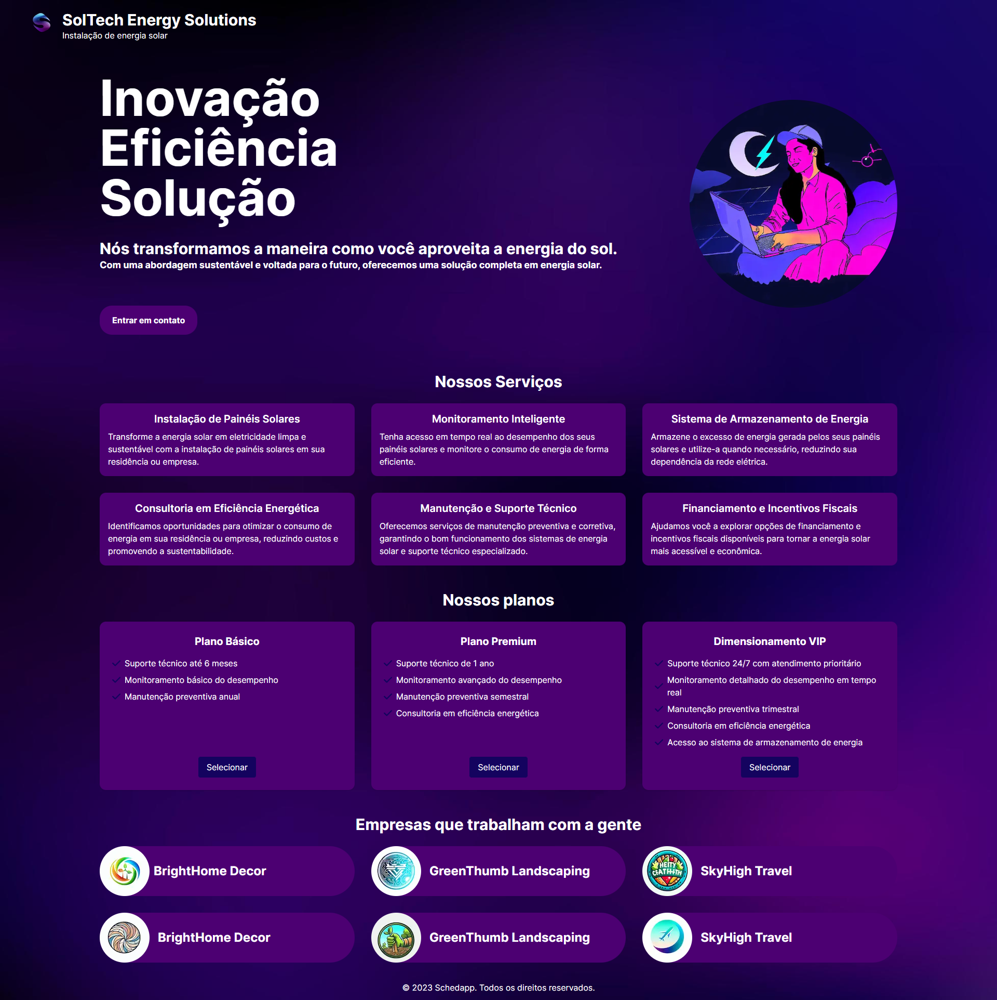

# Interface da Frontpage de uma Empresa

Este é um projeto pessoal que consiste em uma interface de frontpage para uma empresa genérica. O projeto foi desenvolvido utilizando Next.js e aproveitando as capacidades de geração de imagens da IA do Bing. O objetivo principal é fornecer uma interface elegante e atualizada para a página inicial da empresa, oferecendo uma experiência visual atraente para os visitantes.

## Recursos e Funcionalidades

- Utiliza o Next.js, um framework de React.js, que permite a construção de aplicações web modernas e eficientes.
- Utiliza o Tailwind CSS, um framework de estilos utilitários de alto desempenho, é utilizado para criar interfaces elegantes e personalizadas.
- Utilização da IA do Bing para a geração de imagens dinâmicas e personalizadas, tornando a página inicial única e impactante.
- Layout responsivo e adaptável, garantindo uma experiência consistente em dispositivos móveis, tablets e desktops.
- Design moderno, com elementos visuais atrativos e cuidadosamente selecionados para transmitir profissionalismo e modernidade.
- Facilidade de uso e personalização, permitindo que o conteúdo da frontpage seja facilmente atualizado e adaptado às necessidades da empresa.

## Como utilizar

Para utilizar este projeto em sua empresa, siga as etapas abaixo:

1. Clone este repositório em sua máquina local.
2. Instale as dependências do projeto utilizando o gerenciador de pacotes de sua preferência (exemplo: npm install ou yarn install).
3. Personalize o conteúdo da frontpage de acordo com as informações e necessidades da sua empresa.
4. Utilize a IA do Bing para a geração dinâmica das imagens de acordo com seu projeto (consulte a documentação fornecida pela Microsoft para mais detalhes).
5. Inicie a aplicação localmente utilizando o comando adequado do Next.js (exemplo: npm run dev ou yarn dev).
6. Acesse a página inicial em seu navegador e verifique se tudo está funcionando corretamente.
7. Faça os ajustes e customizações adicionais necessárias para atender às especificidades da sua empresa.
8. Implante a aplicação em um servidor ou serviço de hospedagem adequado para disponibilizá-la publicamente.

## Contribuição

Contribuições são bem-vindas! Sinta-se à vontade para abrir uma issue para relatar problemas, sugestões ou melhorias. Se desejar, também pode fazer um fork do repositório e enviar um pull request com suas alterações.

## Licença

Sinta-se à vontade para utilizar, modificar e distribuir o código fonte de acordo com os termos da licença.